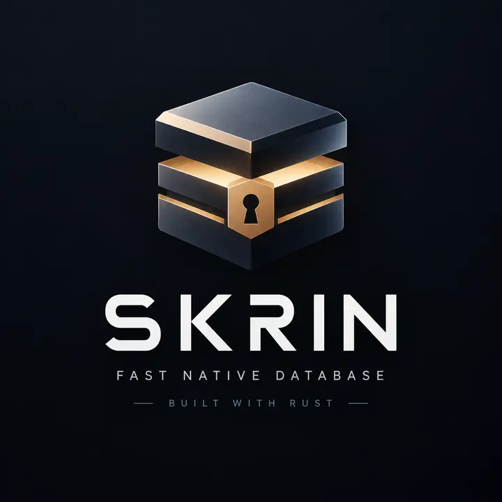

<p align="center">
  
</p>

<p align="center"><strong>Native Rust values. Explicit transactions. Durable state.</strong></p>
<p align="center">
  <a href="https://github.com/Mik-pe/skrin/actions/workflows/ci.yml"></a>
  
  
  
</p>
<p align="center">
  <a href="#get-started">Get started</a> · <a href="#the-api">The API</a> · <a href="docs/durability.md">Durability</a> · <a href="docs/roadmap.md">Roadmap</a>
</p>

---

**Skrin** is a small, typed, embedded database written in Rust. Work with ordinary Rust values, borrow reads without decoding, and commit changes through one controlled write path. No SQL parser. No network server. No second database hidden underneath.

*Skrin* is Swedish for a small chest: a place to keep things worth saving.

> **Experimental, not production-certified.** The transaction and recovery engine is executable and tested, including managed checkpoints, verified backups and offline migrations. API compatibility is not frozen. Publishing remains disabled; no SpacetimeDB performance claim is made.

## Get started

```sh
git clone https://github.com/Mik-pe/skrin.git
cd skrin
cargo test --workspace --locked
cargo run -p skrin --example accounts
```

The first example runs entirely in memory. On Linux/macOS, run the complete **create → update → checkpoint → backup → migrate → reopen** lifecycle with two **new** directory paths:

```sh
cargo run -p skrin --example lifecycle -- /tmp/skrin-demo /tmp/skrin-backup
```

Existing paths are never overwritten. Pick new paths on subsequent runs; their parent directories must exist. The example leaves its databases in place for inspection. See [the complete executable source](crates/skrin/examples/lifecycle.rs).

To use the unpublished crate from another Rust workspace:

```toml
[dependencies]
skrin = { git = "https://github.com/Mik-pe/skrin", branch = "main" }
```

For reproducible experiments, pin a reviewed commit with `rev` instead of following `main`. A distribution license has not been selected; see [release gates](docs/roadmap.md#release-gates).

## The API

Define a `Record` with an explicit, stable schema and codec. Then use typed transactions. This excerpt uses `Account` from the [accounts example](crates/skrin/examples/accounts.rs):

```rust
let db = Database::<Account>::create_dir("accounts.skrin")?;

db.write(|tx| {
    tx.insert(42, Account { name: "Alice".into(), balance: 100 })?;
    tx.insert(7, Account { name: "Bob".into(), balance: 100 })?;
    Ok(())
})?; // The WAL is synced before success and visible publication.

{
    let read = db.read()?;
    let account: &Account = read.get(42).unwrap();
    println!("{}: {}", account.name, account.balance);
} // Drop read guards before writing or running maintenance.

let checkpoint = db.checkpoint()?;
let cleanup = db.prune()?; // Keep active + previous generation.
let backup = db.backup_to("accounts-backup.skrin")?;
```

`insert` rejects duplicates. `put` explicitly inserts or replaces. `update` requires an existing row and returns a complete replacement without requiring `Clone`. `remove` reports whether a row existed. Transaction reads see earlier staged changes. Propagating an error rolls back the closure; dropping a manual transaction discards its staging.

<details>
<summary><strong>Why an explicit codec?</strong></summary>

Rust's native memory layout is not the disk format. Table identity, schema version and field encoding remain stable across refactors:

```rust
impl Record for Account {
    const SCHEMA: Schema = Schema { table_id: 1, version: 1 };

    fn encode(&self, encoder: &mut Encoder) -> Result<()> {
        encoder.string(&self.name)?;
        encoder.u64(self.balance)
    }

    fn decode(decoder: &mut Decoder<'_>) -> Result<Self> {
        Ok(Self {
            name: decoder.string()?.to_owned(),
            balance: decoder.u64()?,
        })
    }
}
```

Skrin validates schema identity before decoding and rejects trailing record bytes. Changes in field meaning or representation require a schema version and an explicit migration, not a cast of old bytes into a new struct.

</details>

## Keep it, compact it, evolve it

| Operation | Contract |
| --- | --- |
| `create_dir` / `open_dir` | Managed generations, permanent directory ownership, authoritative checksummed manifest |
| `checkpoint` | Verified snapshot + fresh WAL; preserves rows and committed sequence; blocks transactions |
| `prune` | Explicit retention of active + previous generations; skips unknown content |
| `backup_to` | Consistent new directory; independently decodes the snapshot; never overwrites its destination |
| `migrate::<NewRecord>` | Consumes the old handle; preserves table/key identity; records a named, forward schema transition |
| `generation_info` / `stats` | Generation, migration history, row count, committed sequence, WAL bytes and repaired-tail bytes |
| `create` / `open` | Original standalone v1 files; no implicit conversion or in-place compaction |
| `in_memory` | Explicitly volatile; no serialization or disk I/O |

An offline migration uses **both real record types**. The old codec reads old storage; the closure builds the new value; the new codec is validated before publication:

```rust
let db = db.migrate::<PersonV2>("split-name-v2", |_, old| {
    let (first, last) = old.full_name.split_once(' ')
        .ok_or_else(|| Error::Codec("missing surname".into()))?;
    Ok(PersonV2 {
        first_name: first.into(),
        last_name: last.into(),
        active: true,
    })
})?;
```

This excerpt is from the runnable lifecycle example above. After publication, the old record type is refused. A failed conversion leaves the original generation active. To import a v1 file, open it with its original `Record` and call `backup_to` on a new directory; the source is not rewritten.

## Safety is a contract, not a badge

A successful persistent write means **encode → append → sync → publish**. Complete corruption is an error, not permission to truncate. Only an incomplete final WAL frame may be repaired. Directory recovery follows `CURRENT`; it never guesses the newest filename or silently falls back to an older schema.

A write/sync failure returns `CommitUncertain`. A generation-publication failure may return `MaintenanceUncertain`. Either poisons the handle, including reads: close, reopen, and reconcile the actual state. No successful response is not proof of rollback.

The tests cover malformed and interrupted logs, snapshot/manifest corruption, migration failures, subprocess exits at publication boundaries, stable cross-process locks, independent format fixtures and reference-model transactions. They are **not** a certification against every filesystem, device or power-loss failure.

Read [durability](docs/durability.md) and the [managed storage protocol](docs/managed-storage.md) before storing important data.

## Deliberately small

| Area | Current boundary |
| --- | --- |
| Data model | One typed table per database; `u64` primary keys; data and primary index fit in RAM |
| Reads | Borrowed values, ordered iteration, primary-key ranges; read guards block writers |
| Writes | One serialized writer; staged deltas, not whole-database copies on each commit |
| Maintenance | Explicit and serialized; snapshot verification temporarily duplicates resident data; caller provides disk headroom |
| Retention | Call `checkpoint` and `prune`; maintenance is not an automatic background service |
| Limits | 8 MiB per encoded record; 16 MiB per transaction payload; snapshots can exceed the transaction limit |
| Platforms | Memory mode tested on Linux/macOS/Windows; persistent backends currently Unix-only |
| Not implemented | Multi-table schemas, secondary indexes, MVCC, group commit, derive macros, encryption, replication |

Never nest transactions, hold guards across `await`, or perform external side effects in transaction/migration closures. Records must have immutable value semantics. A Rust-only API and advisory locks are not access control against another process with filesystem permissions.

## Measure the right thing

```sh
cargo bench -p skrin --bench baseline
cargo bench -p skrin --bench baseline -- --durable /tmp
cargo bench -p skrin --bench maintenance -- /tmp
```

The baseline separates a plain `BTreeMap`, volatile operations and synced transactions. Maintenance measures checkpoint/prune pauses, disk footprint and warm-cache reopen with verification after every round. Shared CI and container timings are smoke evidence, not published performance comparisons.

## Work on Skrin

```sh
cargo +1.89.0 fmt --all -- --check
cargo +1.89.0 clippy --workspace --all-targets --locked -- -D warnings
cargo test --workspace --locked
cargo test --workspace --release --locked
RUSTDOCFLAGS='-D warnings' cargo doc --workspace --no-deps --locked
```

Start with [architecture](docs/architecture.md), [v1 file format](docs/file-format.md), [managed storage](docs/managed-storage.md), [benchmarks](docs/benchmarks.md), and [the roadmap](docs/roadmap.md). Contributions should preserve the failure contract before expanding the API.
